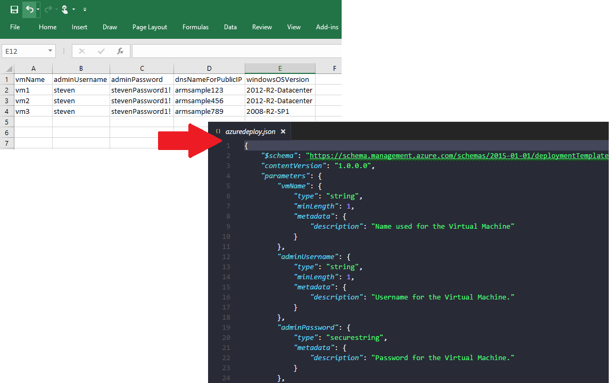

# CSVProvisioner
## Integrate ARM Template Parameters from a CSV file

This sample takes rows of a CSV file as parameters and combines them with an ARM Template deployment

* The CSV file is located at `/csv` and each column heading corresponds to a parameter
* The ARM Template is a basic Windows Server template taken from Visual Studio's File -> New Project menu with minimal adjustments of a vmName
* This is a demonstration only, as a real world scenario would likely include only one virtual network

Resources

* [Deploy an SSH Enabled VM with a Template in Node.js](https://github.com/Azure-Samples/resource-manager-node-template-deployment)
* [Deploy an SSH Enabled VM with a Template with .NET](https://github.com/Azure-Samples/resource-manager-dotnet-template-deployment)

> Ensure that you setup `/config/config.js` with your [Service Principal](https://azure.microsoft.com/en-us/documentation/articles/resource-group-authenticate-service-principal-cli/) values

