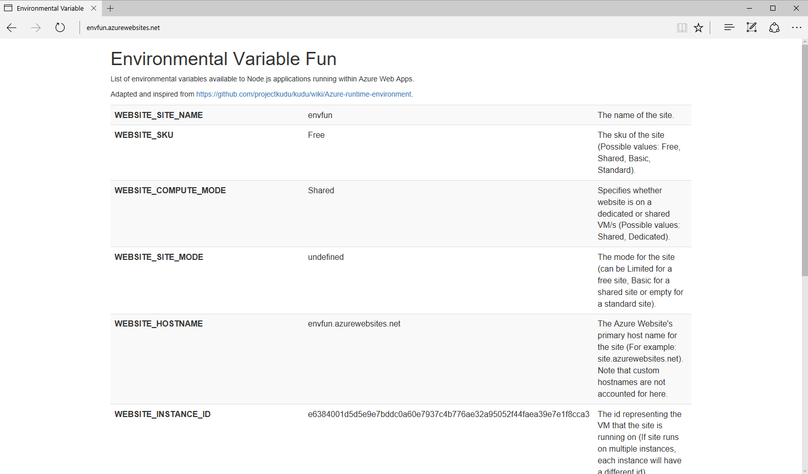

# Environment Fun

Azure Web Apps expose a variety of environment variables that can be used within an application.  This is a Node.js sample application exposing such variables.

Documentation taken from the [Kudu Wiki](https://github.com/projectkudu/kudu/wiki/Azure-runtime-environment) plus various other variables of interest.

