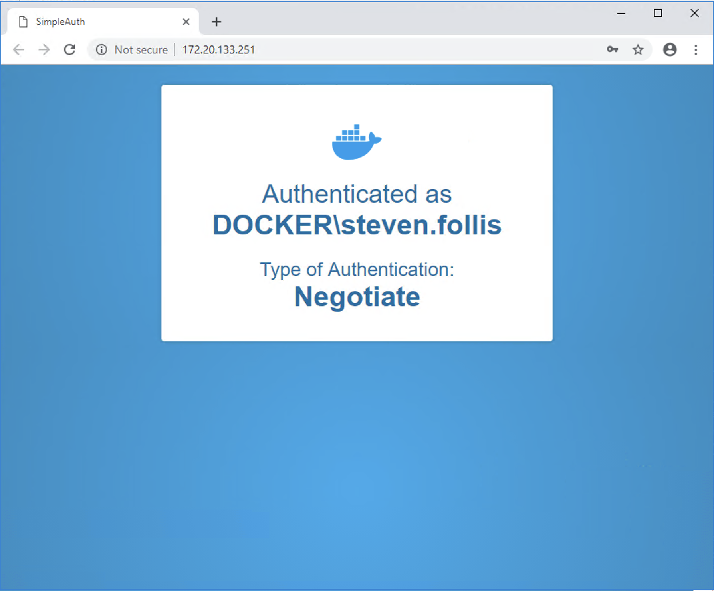

# SimpleAuth

This is a [very] simple application used to test Group Managed Service Accounts (gMSA) with Windows Server Containers.



## Building

```
docker container build `
    --tag simple-auth
    .
```

## Running

```
# Run the container
docker container run `
    --name simple-auth `
    --detach `
    --publish 80 `
    --hostname simple-auth-gmsa `
    --security-opt "credentialspec=file://simple-auth-gmsa.json" `
    simple-auth;

# Grab container port and load in Chrome
Start-Process chrome "http://$(docker container inspect --format '{{ .NetworkSettings.Networks.nat.IPAddress }}' simple-auth):80";
```